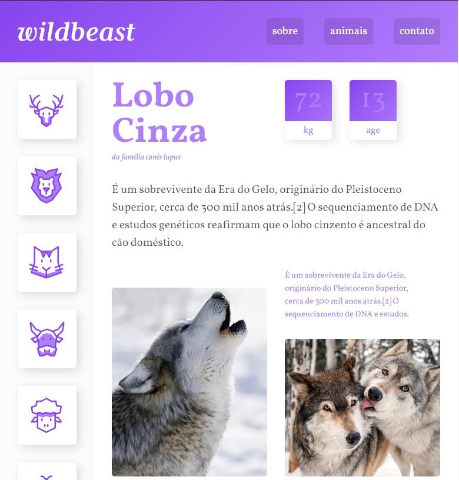

<h2>Olá ❕</h2>
<h3>➡️Este projeto foi criado usando <strong>HTML5 e CSS Grid Layout</strong></h3>

Criado durante o curso de CSS Grid Layout da Origamid.

</img>

Foi aplicado aqui meus conhecimentos de HTML5 e CSS Grid Layot para criação de uma <strong>API WEB responsíva</strong>, além de solidificar os conceitos de <strong>UX/UI</strong>✔️

<em>'Este projeto não possui fins comerciais, foi realizado somente para aplicação de estudos'📚</em>

<strong>----João Vítor Carvalho 👨‍💻 ---</strong>