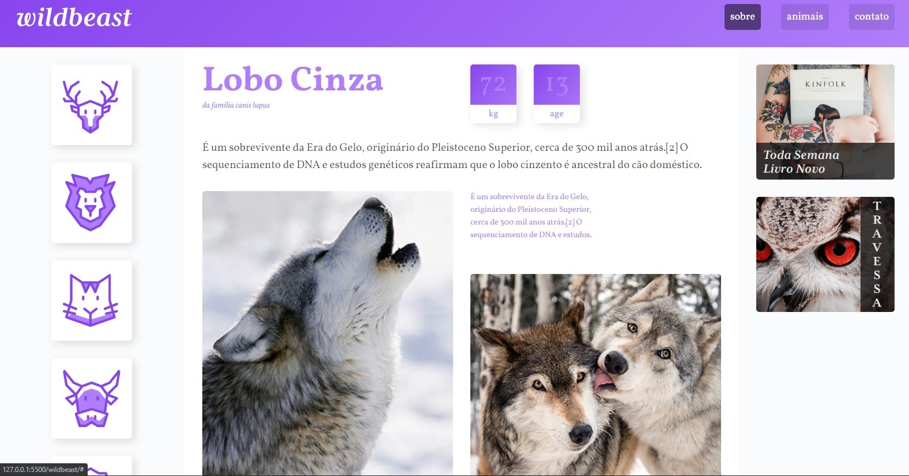
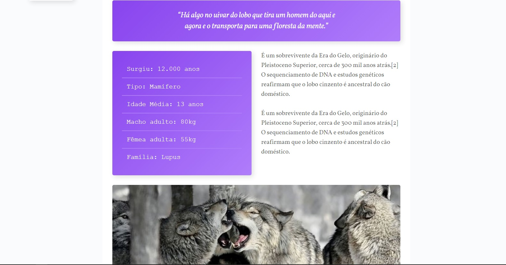
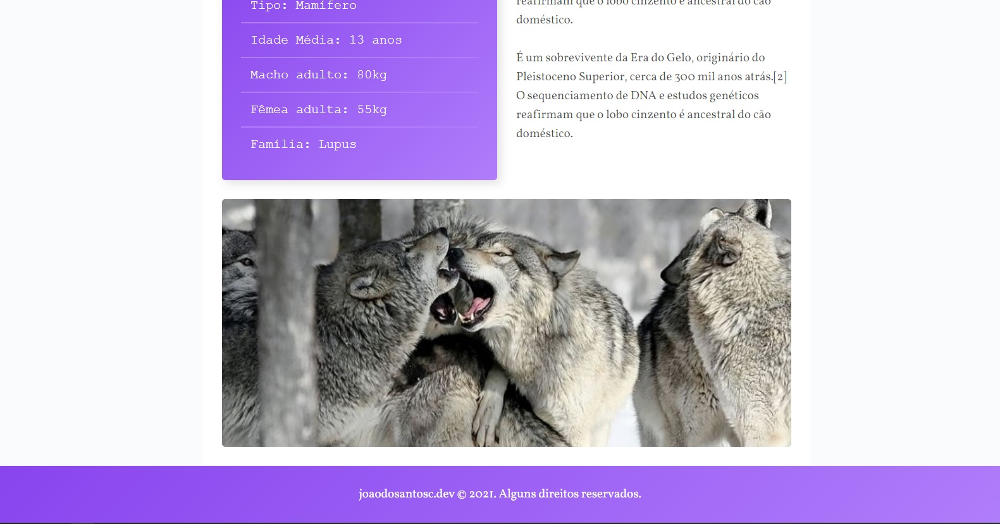
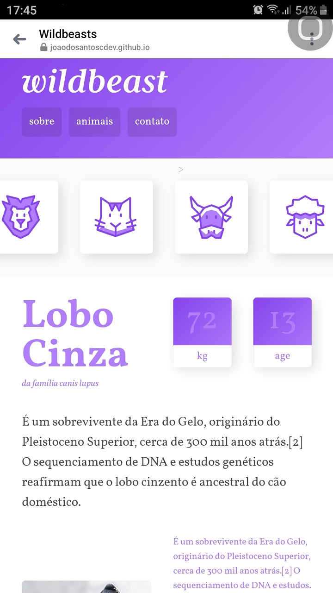
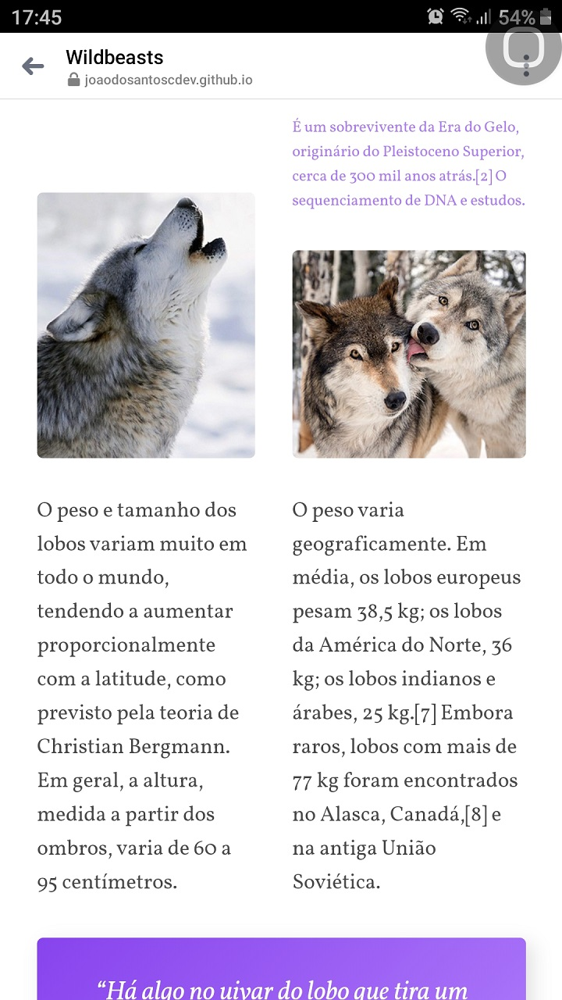
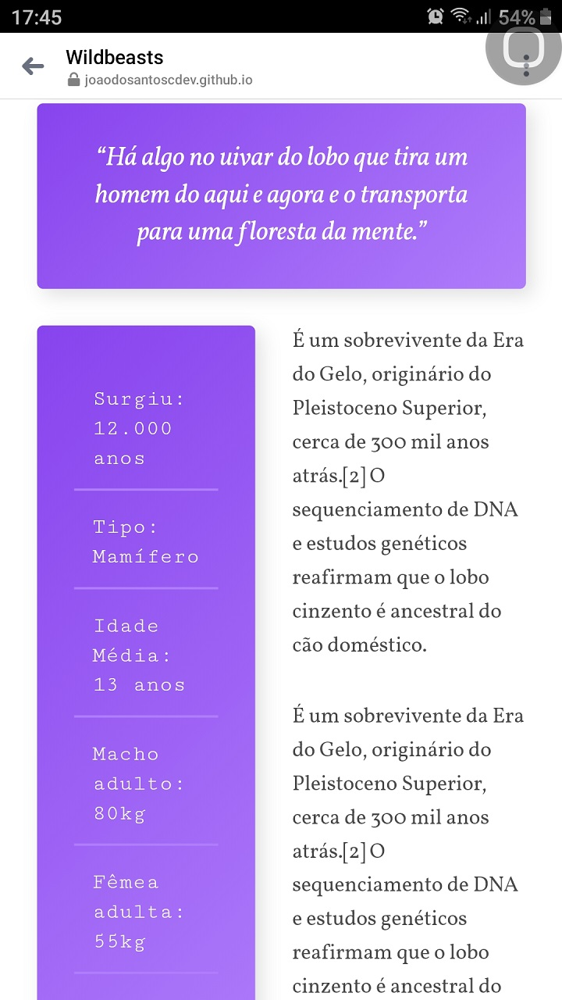
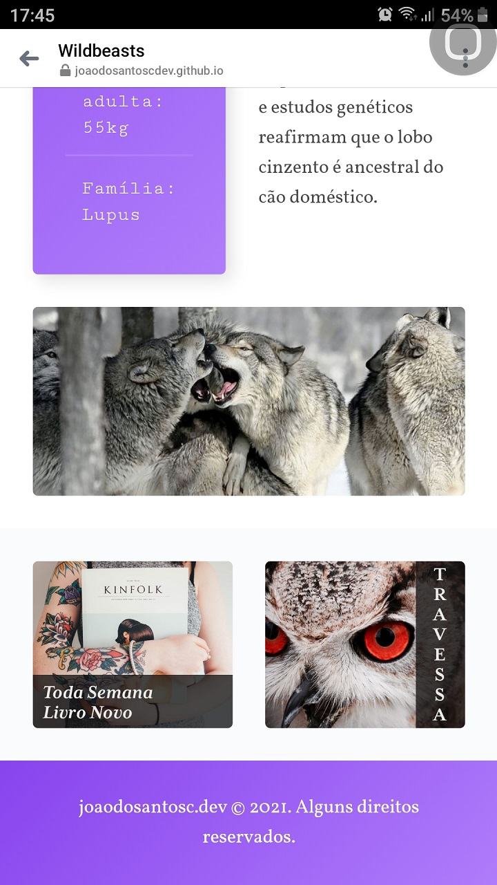

<h2>Hello ❕</h2>
<h3>➡️This project was developed using <strong>HTML5 e CSS Grid Layout</strong> 🛠️</h3>

➡️Developed during Origamid CSS Grid Layout classes.

You can acess <a href="https://joaodosantoscdev.github.io/wildbeasts/wildbeast/" target="_blank" alt="wildbeasts">here</a>.

<h3>Desktop 🖥️</h3>
</img>
 
</img>
 
</img>

<h3>Mobile 📱</h3>

</img>
 
</img>
 
</img>
 
</img>

<h3>Overview ⮯</h3>

Was applicated here my knowledges in HTML5 e CSS Grid Layout to create a <strong>responsive API WEB</strong>, 
solidifying my <strong>UX/UI concepts</strong>✔️

It's a one-page static website, with all the content being tottaly styleshed in CSS Grid Layout.The main objective on this was to use all the properties available at this resource, alligned with a design concept, to apply and absorve praticly all the content during the lessons.🧑‍💻

Totally responsive and compatible with mobile devices. 📱

<em>'This project has no commercial purposes, it was carried out only for the application of my studies'📚</em>

<strong>----João Vítor Carvalho 👨‍💻 ---</strong>
